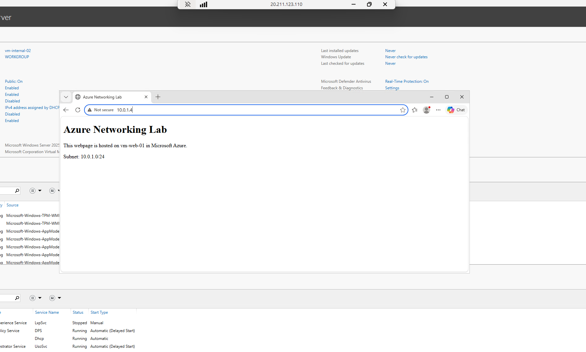
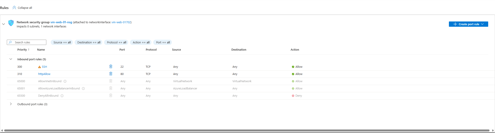
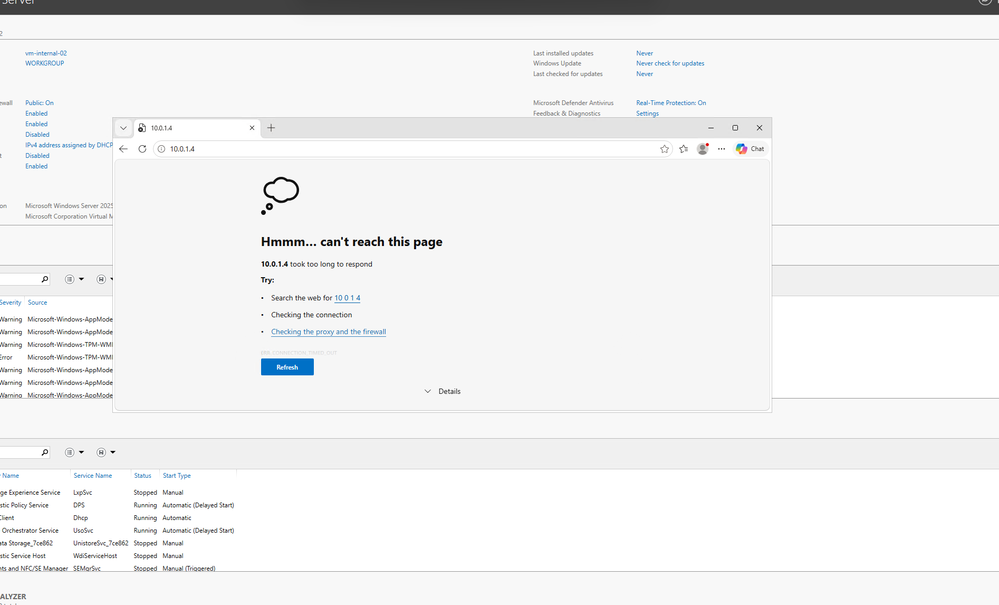
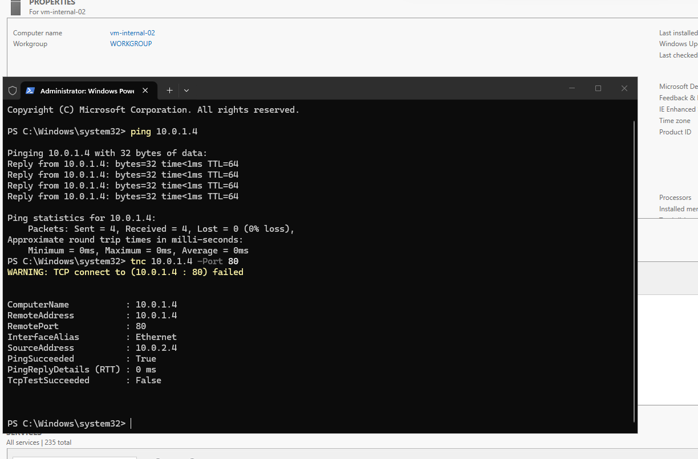
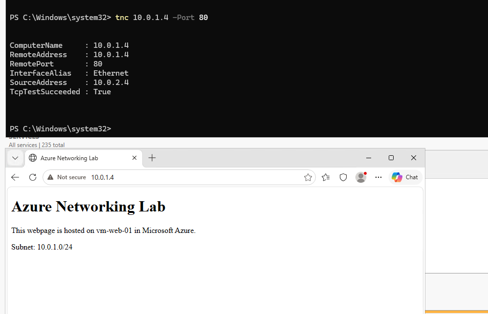

# azure-networking-lab

Deployment and configuration of a Microsoft Azure network environment

## Project Overview

The goal of this project is to gain a deeper understanding of Azure through practical methods, a segmented Azure network that contains multiple subnets for public and internal services will be created.

The network will then be configured with security controls while virtual machines will be deployed to test connectivity between the resources. The valid connection will then be deliberately altered to create a scenario that requires troubleshooting. This scenario will provide a practical understanding of the Azure cloud environment. 

## Architecture

## Network Design

| Resource | Address Range | Purpose |
|---|---|---|
| Vnet | 10.0.0.0/16 | Create a virtual network
| Web Subnet | 10.0.1.0/24 | Create a subnet for public facing services
| Internal Subnet | 10.0.2.0/24 | Create a subnet for private services

## Design Decisions

A /16 design for Vnet was chosen to allow for plenty of room for subnets as the environment expands.

A /24 was picked for both subnets to provide 256 addresses per subnet while keeping internal and web services separated. Separating these services gives the option to apply different network security rules for public and private resources.

## Resources Deployed
- Azure Virtual Network
- Web subnet
- Internal subnet
- Ubuntu Linux VM
- Windows Server VM
- Network Security Group
- Public IP
- Nginx web server

## Web Server Configuration
Nginx was installed on the vm-web-01 to host a basic test webpage, HTTP uses TCP on port 80 so a NSG rule was created to allow for HTTP traffic.
## Private Network Connectivity
The Windows VM (vm-internal-02) was deployed in the internal subnet using a private IP address 10.0.2.4. The Linux web server (vm-web-01) was deployed in the web subnet using the private IP 10.0.1.4.

The connection between these two subnets was tested by connecting to an Nginx web server that was deployed within the Linux VM. The webpage loaded successfully and this confirmed that the two virtual machines were able to communicate across the Azure VNet.

## Network Security
A Network Security Group (NSG) was created to control traffic going to the web server.

An inbound security rule was configured to allow TCP traffic on port 80 for HTTP access to the Nginx web server.

## Troubleshooting Scenario

### Issue
The website that was being hosted on the Linux VM was now inaccessible from the Windows VM. When a connection was attempted it would result in a timeout.

### Investigation
A ping test to 10.0.1.4 was working which confirmed that the two VM's still had basic network connectivity.

I then used Test-NetConnection to test TCP port 80. The ping test worked but the TCP test failed, this highlighted that the problem was related to TCP port 80 rather than a genral connection issue.

The NSG rules were investigated and a Deny rule relating to TCP port 80 was found. This deny rule had a higher priority than the allow HTTPS rule.

### Resolution
The Deny rule was removed from the Network Security Group allowing the HTTP rule to grant TCP port 80 traffic again.
### Validation
Test-NetConnection was run again after removing the Deny rule and TCP test was now successful. Now the Nginx webpage was able to load on the Windows VM,

## Skills Gained

## Key Takeaways
